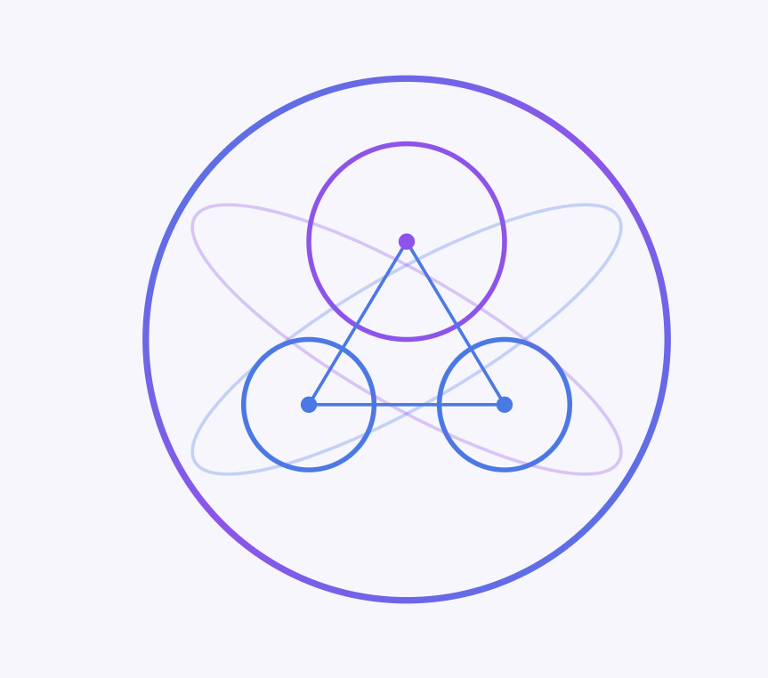

<div align="center">
  
  <!-- Title Banner -->
  # ✨ Aurora - The AI Universe ✨
  ### 🌌 Illuminate Your AI Journey 🌌

  <!-- Badges -->
  
  
  
  
  
  
  <!-- Project Banner Image -->
  
  
  ## Aurora - The AI Universe

  <!-- Quick Links -->
  [Live Demo](your-demo-link) • [Documentation](your-docs-link) • [Report Bug](your-issues-link) • [Request Feature](your-issues-link)

</div>

---

<!-- Project Overview -->
## 🎯 About The Project

Aurora is an immersive AI services hub that brings together multiple machine learning capabilities in one elegant interface. Built as a learning project to explore the integration of Hugging Face's Transformers.js with Node.js and React, it demonstrates the power and accessibility of modern AI technologies.

<!-- Video Demo Placeholder -->
<div align="center">
  
  <p><em>Aurora AI in action - Demo Video Coming Soon!</em></p>
</div>

<!-- Features -->
## ✨ Key Features

- 🎨 **Sentiment Analysis** - Analyze text emotions using state-of-the-art models
- 🎤 **Speech Recognition** - Convert speech to text with Whisper
- 🌍 **Translation** - Break language barriers with neural translation
- ✍️ **Text Generation** - Create content using LaMini-Flan-T5
- 📸 **Image Classification** - Identify objects in images
- 🔊 **Text to Speech** - Convert text to natural-sounding audio
- 📝 **Image to Text(Captions Generation)** -Generates text for images
- 🎮 **Interactive UI** - Beautiful, responsive interface with modern animations

<!-- Tech Stack -->
## 🛠️ Built With

- ⚛️ **Frontend**
  - React 18.2.0
  - CSS3 with Modern Features
  - Lucide Icons
  - Tailwind CSS
  
- 🖥️ **Backend**
  - Node.js
  - Express.js
  - Transformers.js
  
- 🤖 **AI/ML**
  - Hugging Face Models
  - Transformers.js Pipeline
  - WebGL Acceleration

<!-- Getting Started -->
## 🚀 Getting Started

### Prerequisites

- Node.js 20.x or higher
- npm/yarn
- Modern web browser with WebGL support

### Installation

1. Clone the repository
```bash
git clone https://github.com/Adiwanwade/aurora-ai.git
```

2. Install dependencies
```bash
cd aurora-ai
npm install
```

3. Set up environment variables
```bash
cp .env.example .env
# Edit .env with your configurations
```

4. Start the development server
```bash
npm start
```

<!-- Usage Examples -->
## 💡 Usage Examples

<details>
<summary>Click to expand usage examples</summary>

### Sentiment Analysis
```javascript
// Example code for sentiment analysis
const sentiment = await analyze("I love this project!");
console.log(sentiment); // { positive: 0.92, negative: 0.08 }
```

### Text Translation
```javascript
// Example code for translation
const translated = await translate("Hello world", "fr");
console.log(translated); // "Bonjour le monde"
```

</details>

<!-- Learning Journey -->
## 📚 Learning Journey & Implementation

This project was built as a hands-on exploration of:

1. **Transformers.js Integration**
   - Loading and running models in the browser
   - Optimizing inference performance
   - Managing model weights and tokenization

2. **React Best Practices**
   - Component architecture
   - State management
   - Performance optimization

3. **Modern CSS Techniques**
   - Glassmorphism effects
   - Advanced animations
   - Responsive design

4. **AI Model Deployment**
   - Model quantization
   - Caching strategies
   - Error handling

##

<!-- Contributing -->
## 🤝 Contributing

Contributions make the open-source community an amazing place to learn, inspire, and create. Any contributions you make are **greatly appreciated**.

1. Fork the Project
2. Create your Feature Branch (`git checkout -b feature/AmazingFeature`)
3. Commit your Changes (`git commit -m 'Add some AmazingFeature'`)
4. Push to the Branch (`git push origin feature/AmazingFeature`)
5. Open a Pull Request

<!-- Roadmap -->
## 🗺️ Roadmap

- [ ] Add user authentication
- [ ] Implement more AI models
- [ ] Add batch processing
- [ ] Create API documentation
- [ ] Add tests
- [ ] Implement progressive web app features

<!-- Contact -->
## 📫 Contact

Aditya Wanwade - [@yourtwitter](https://twitter.com/yourtwitter) - Adiwanwade@gmail.com

Project Link: [https://github.com/Adiwanwade/aurora-ai](https://github.com/yourusername/aurora-ai)

<!-- Acknowledgments -->
## 🙏 Acknowledgments

- [Hugging Face](https://huggingface.co/) for their amazing models and tools
- [Transformers.js](https://huggingface.co/docs/transformers.js) documentation
- [React](https://reactjs.org/) team for the awesome framework
- All the amazing developers who contribute to open source

---

<div align="center">
  
  Made with ❤️ by [Aditya Wanwade](https://github.com/Adiwanwade)
  
  ⭐️ Star us on GitHub — it helps!

</div>